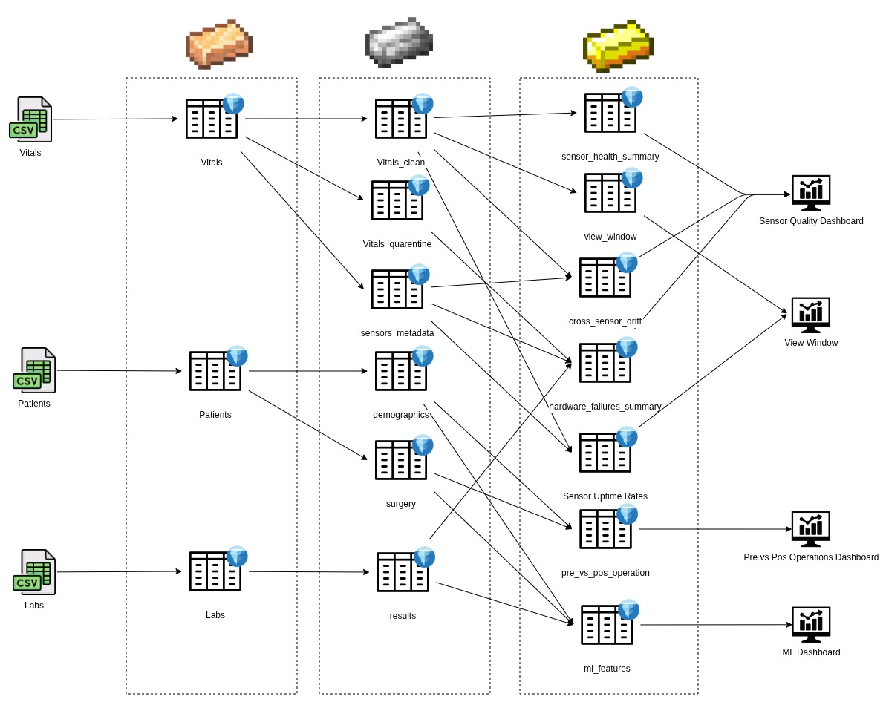
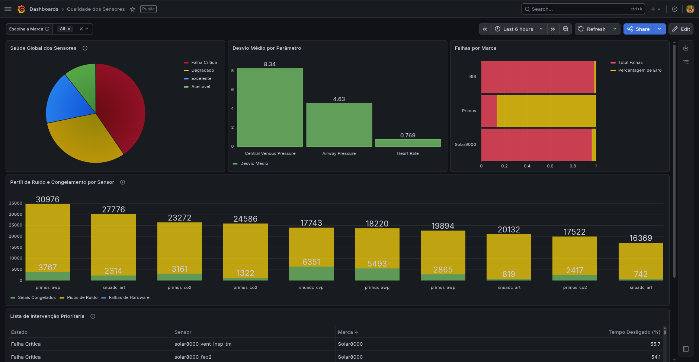
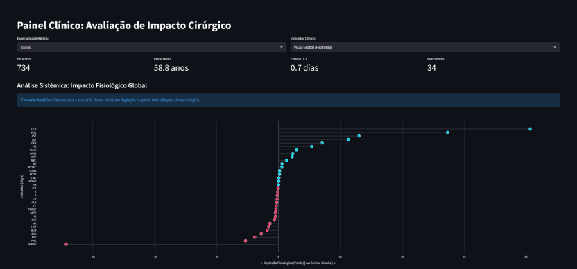
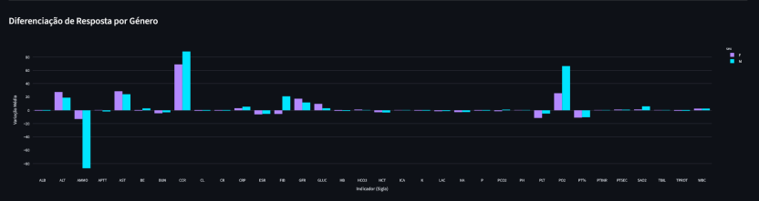
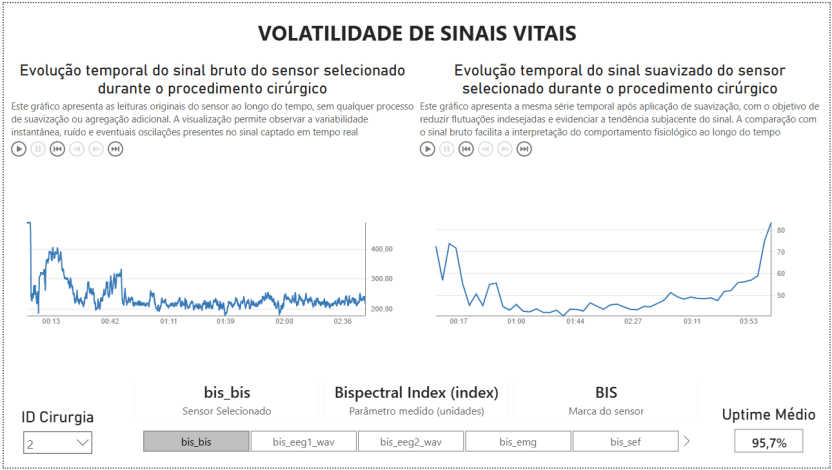
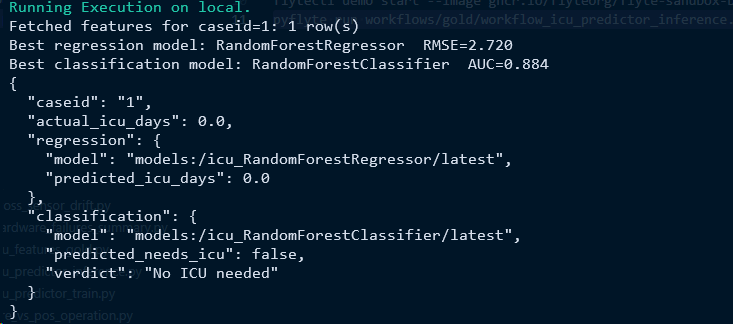

<h1 align="center">Practical Work on Tecnologias Escaláveis para Análise de Dados (Scalable Technologies for Data Analysis)</h1>

  
  
  

---

## Clinical Analytics Data Lakehouse

This project implements an end-to-end scalable Data Lakehouse designed to process, clean, and analyze massive volumes of high-frequency perioperative clinical data. The architecture targets the common healthcare problem of noisy sensor data, disconnected silos, and asynchronous laboratory results.

Developed for the Master's in Informatics Engineering, the platform guarantees data reliability through strict Data Contracts and serves high-performance analytics to clinical dashboards and Machine Learning inference pipelines.

### Authors
* Diogo Pereira
* Duarte Sampaio
* Hugo Guimarães
* Nuno Silva

---

## Medallion Architecture & Tech Stack

The system implements the **Medallion Architecture** pattern, progressively refining data through three distinct layers, physically separating compute from storage.

* **Storage & Table Format:** MinIO (Object Storage) + Apache Iceberg.
* **Compute & Query Engine:** Trino (Distributed SQL).
* **Orchestration:** Flyte (DAG-based Workflow Engine).
* **Machine Learning:** MLflow (Model Registry & Experiment Tracking).
* **Visualization:** Grafana & Streamlit.

  <table align="center">
    <tr>
      <td bgcolor="white" align="center">
        
         <em>Fig 1. Data flow through Bronze, Silver, and Gold layers</em>
      </td>
    </tr>
  </table>

---

## Data Governance & Quality

To ensure analytical readiness, the pipeline enforces strict governance mechanisms:
1. **Data Contracts & Quality Gate:** YAML-based Open Data Contract Standards (ODCS) evaluated dynamically in Flyte via a Circuit Breaker pattern.
2. **Idempotency & Upserts:** Prevents duplication on rerun by crossing primary keys and enforcing ACID overwrites on the Iceberg tables.
3. **Quarantine Strategy (DLQ):** Invalid records are isolated into a Dead Letter Queue (DLQ) table with an `error_reason` column, preserving healthy data availability.

---

## Data Products & Dashboards

The Gold layer exposes pre-aggregated metrics directly to our visualization tools to answer critical clinical and operational questions.

### Sensor Health & Quality (Grafana)
Transforms raw anomalies into actionable predictive maintenance insights for hospital engineering teams.

  <table align="center">
    <tr>
      <td bgcolor="white" align="center">
        
         <em>Sensor Health and Quality Monitoring Dashboard</em>
      </td>
    </tr>
  </table>

### Pre vs. Post-Op Physiological Impact (Streamlit)
Visualizes the biochemical variance and physiological wear caused by surgical stress, stratified by gender and specialty.

  <table align="center">
    <tr>
      <td bgcolor="white" align="center">
        
          
        
         <em>Pre and Post-Operative Clinical Impact Analysis</em>
      </td>
    </tr>
  </table>

### Vital Signs Volatility (PowerBI)
Compares raw and smoothed high-frequency vital signs during surgical procedures, highlighting the effectiveness of noise reduction algorithms and aiding clinical interpretation.

  <table align="center">
    <tr>
      <td bgcolor="white" align="center">
        
         <em>Raw vs. Smoothed Vital Signs Comparison</em>
      </td>
    </tr>
  </table>

### Post-Op ICU Admission Predictor (MLflow & Flyte)
An automated inference pipeline that fetches real-time patient features and dynamically loads the best-performing models from the MLflow Registry to predict ICU admission necessity and estimated length of stay.

  <table align="center">
    <tr>
      <td bgcolor="white" align="center">
        
         <em>Flyte Pipeline Execution Output for ICU Prediction</em>
      </td>
    </tr>
  </table>

---

**Note:** `flytekit` currently presents compatibility issues with Python 3.13. A downgrade to Python 3.11 is required. We recommend using `uv` for fast environment management
